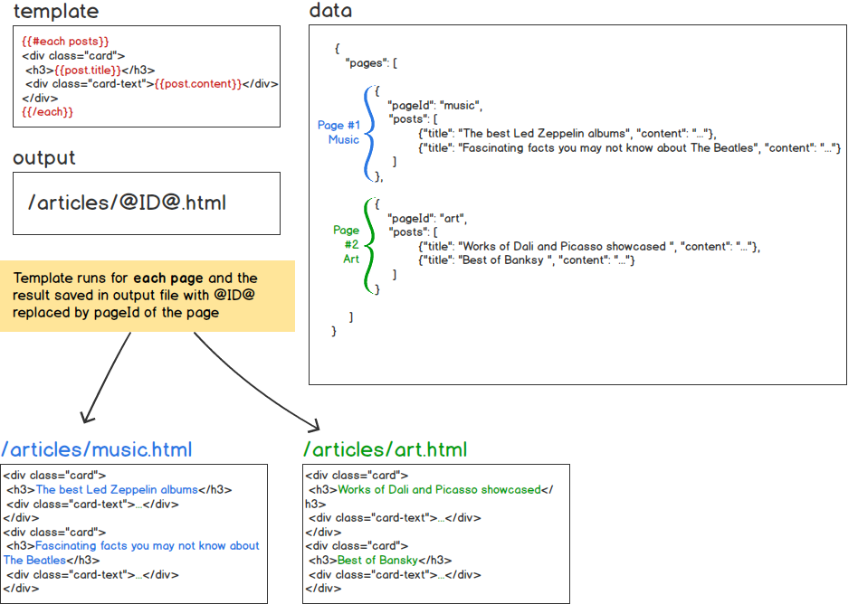

# candygen :candy:

Highly customizable multi-purpose rule based generator that can be used in a wide variety of use-cases. Candygen has been previously used for building static websites with arbitrary structure, email templating and even code generation (see [Examples](#examples) section for more details).

## Getting Started

These section will guide you through installation and basic setup for your first candygen project.

## Live Demo

[](https://codesandbox.io/s/2ojvol3yyp)

### Prerequisites

In order to use candygen you will need to have [Node.js](https://nodejs.org/en/) installed on your system. 

Examples below use [yarn](https://yarnpkg.com/en/) for package management. However, same results could be achieved by using corresponding `npm` commands.

### Installation

Create an empty folder for your project:

```
mkdir myproject
cd myproject
```

Optionally, run `npm init` or `yarn init` to create a `package.json`:

```
yarn init
```

Add candygen generator as a dependency to your project:

```
yarn add @candygen/generator
```

Create initial candygen configuration file, by running:

```
yarn cg init
```

This will create a file named `candygen.config.js`, with following content:

```javascript
module.exports = {  
  init: function () {
    return {
      schemaVersion: '1.0',
      rules: [
        // {
        //   template: '',
        //   script: '',
        //   data: '',
        //   output: ''
        // }
      ]
    }
  }
};
```

### Usage example

Candygen [configuration](#configuration-file) file should always contain a method called `init()` that returns JavaScript object with the final rule set, partials and helpers definition

Modify `candygen.config.js` to look like:

```javascript
module.exports = {  
  init: function () {
    return {
      schemaVersion: '1.0',
      rules: [
        {
          template: 'index.html.hbs',
          data: 'data.json',
          output: 'index.html'
        }
      ],
      partials: []
    }
  }
};
```

Create a new file `data.json` with the following content:

```json
{"message":"Hello, World!"}
```

And another file named `index.html.hbs` containing: 

```html
<!DOCTYPE html>
<html>
<head>
    <title>Welcome!</title>
</head>
<body>
  <h1>{{message}}</h1>
</body>
</html>
```

Run the following command to generate output:

```
yarn cg
```

Check the newly created `output` folder that should contain `index.html` with the following contents: 

```html
<!DOCTYPE html>
<html>
<head>
    <title>Welcome!</title>
</head>
<body>
  <h1>Hello, World!</h1>
</body>
</html>
```
 
### Generator commands

There are several commands that could be used once `@candygen/generator` is added as a dependency in your project folder:

- `yarn cg` - runs generator once
- `yarn cg init` - created `candygen.config.js` with empty default configurations
- `yarn cg version` - outputs the current version of the candygen generator

### Static files folder

If you need to copy a number of files as they are from your project folder into your output folder you should place them in a folder named `static`.
This is particularly useful for asset files in case of static website generation, such as CSS stylesheets, JavaScript files, images etc. 

Below is a small illustration of how this works: 

```
/sample
  candygen.config.js
  /static
    style.css
    /images
      1.png
      2.png
```

If you run:

```
yarn cg
```

You will get:

```
/sample
  candygen.config.js
  /static
    style.css
    /images
      1.png
      2.png
  /output
    style.css
    /images
      1.png
      2.png
```

### Configuration file

Configuration file must always be named `candygen.config.js` and it must always be on the root level of the project folder

This file must contain a method named `init()`:

```javascript
module.exports = {  
  init: function () {
    return [CONFIGURATION];
  }
};
```

`[CONFIGURATION]` must always be an object with the following properties: 

-  `inputPath: string;` [Optional] Change the folder that should be treated as the root input folder by the generator
-  `outputPath: string;` [Optional] Alternative output path for the results of the generation
-  `rules: Rule[];` Set of rules describing the generation process. See **Rule** section below for more details
-  `partials: Partial[];` Set of reusable partial templates that could be used for injecting repeated sections as well as for layouting (For example, for header, footers). See **Partials** section below for more details
-  `helpers?: Helper[];` [Optional] Set of templating helpers implemented in JavaScript. See **Partials** section below for more details


**Rule**

Rule defines an atomic action perfomed by the generator during the output generation process. There several properties for each rule:




*data* (optional)

Data contains data in the JSON format that either will be directly passed to the handlebars template defined under `template` property, or will first be transformed by a script defined in a `script` property. 

In case if data is directly passed to the template it should be in the following format:

```javascript
{
  "pages": [
    {...}
  ]
}
```

*script* (optional)

Path to a JavaScript file containing a function called `run()` that will be executed to prepare the templating data.

In case if `data` property is defined for the rule. The parsed JSON value of the file specified in the `data` property is passed to the `run()` method.

Scripts could be very useful for various transformations on the initial data. An example below illustrates a usage of a script in order to change post titles in the example above to be in the upper case:

```javascript
module.exports = {
  run (data) {
    data.pages.forEach(page => {
      page.posts.forEach(post => {
        post.title = post.title.toUpperCase();
      });
    })
    return data;
  }
}
```

A script must always return output in the following format:


```javascript
{
  "pages": [
    {...}
  ]
}
```

*template*

A relative (to the input folder) path to a [handlebars](http://handlebarsjs.com) template file

*output*

A file name or a file name pattern for the resulting output. Two special tokens are replaced in the output value depending on the resulting page that is being processed. This way *one rule can produce multiple output files*: 

- `@ID@` - `pageId` value of the page will be injected instead of this token
- `@PAGENUM@` - number of the page in the pages array will be injected instead of this token


**Partial**

Partials are defining handlebars partials that can contain repeated sections (such as header, footer, copyrights) or alternative be used as layouts (see [handlebars partials](http://handlebarsjs.com/partials.html) documentation for more details)

Two properties are needed to define a partial:

- `name` - partial's name, will be used in other templates or partials to refer to this partial
- `template` - path to a file containing handlebars template for this partial

Here's an example definition for two partials header and footer:

```javascript
...
schemaVersion: '1.0',
rules: [
  ...
],
partials: [
  {
    name: 'header',
    template: 'templates/partials/header.hbs'
  },
  {
    name: 'footer',
    template: 'templates/partials/footer.hbs'
  }
]
...
```

After being defined these partials can be used in other templates and other partials in the following way:

```html
{{> header}}
<div class="content">
...
</div>
{{> footer}}
```

**Helpers**

Similarly to partials, helpers section can be used to define custom handlebars helpers ([inline](https://handlebarsjs.com/expressions.html) and [block helpers](https://handlebarsjs.com/block_helpers.html) are supported). 

Two properties are needed to define a helper:

- `name` - helper's name, will be used in other templates or partials to refer to this helper
- `fn` - JavaScript function - implementation of this helper

Below is an example helper definition:

```javascript
...
schemaVersion: '1.0',
rules: [
  ...
],
partials: [
  ...
],
helpers: [
  {
    name: 'upperCaseOrMissing',
    fn: (value) => {
      return value ? value.toUpperCase() : 'MISSING';
    }
  }
]
...
```

## Dev Server

Candygen Dev Server runs in background and serves the latest result of the generation. When any input file changes, Dev Server updates the output correspondingly. It is installable as a separate package:

```
yarn add @candygen/dev-server
```

In order to run it, run the following command in the folder contaning `candygen.config.js`:

```
yarn cg-dev
```

Optionally you can specify a port on which dev server will run:

```
yarn cg-dev port=3333
```

## Developing candygen

This repo contains all packages related to candygen and represents a monorepo. It is using (lerna)[https://lernajs.io/] to manage multiple packages.
It is recommended to use [yarn](https://yarnpkg.com/en/) for package management as this project relies on yarn workspaces. This repo includes a basic [VSCode](https://code.visualstudio.com/) configuration for debugging generator and dev-server packages. In order to start developing locally, checkout this repository and run:

```
yarn build
```

To run TypeScript compiler in watch mode for all sub-packages use the following command:

```
yarn tsc-all--watch
```

## Examples

Here's a list of websites using candygen:

- [landmax.pro](https://www.landmax.pro)
- [getguided.net](https://getguided.net)

Another example could be found under `packages/candygen-example`
This example package is also installable running `yarn add @candygen/example`

## Versioning

We use [SemVer](http://semver.org/) for versioning

## Authors

* **Turan Rustamli** ([rustamli](https://github.com/rustamli))

## License

This project is licensed under the MIT License - see the [LICENSE.md](LICENSE.md) file for details

